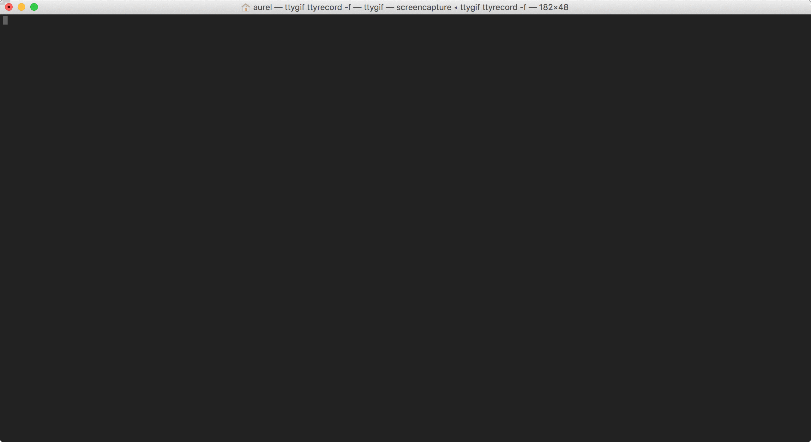

# shprofile - shell profile manager

Manage several shell profiles and switch between them, but not only.

(Formerly _terminal-session-bootstrap_).



## Why?

Because we all have our own way of managing our shell session by:
- Setting the `PATH` or `PS1` variable
- Setting a proxy
- Adding aliases
- Writing a configuration file for a particular command (e.g. [vim](https://www.vim.org/)'s `.vimrc`, [screen](https://www.gnu.org/software/screen/)'s `.screenrc`)
- Applying a mandatory initialization process for a particular command line (e.g. [jenv](http://www.jenv.be/), [nvm](https://github.com/creationix/nvm) or [rbenv](https://github.com/rbenv/rbenv))
- ... _and so on_ 

Because we can be constrained to change these specific settings according to a given environment (e.g., when working with different clients). Then we want to manage them as **profiles**.

## How?

### Available features

- **Manage different shell profiles**
- Define several scripts into a same profile to be able to **modularize shell profiles' scripts** (e.g., 1 script for 1 tool) and easily [import or export them](https://github.com/abourdon/shprofile/tree/master/examples/scripts)
- Apply the **lexicographical order** when discovering shell profiles' scripts
- Allow to define _loading_ and _unloading_ shell profile script types to **handle transition between profiles**
- **Remember the current profile in use** to be able to quickly reload it

### Concept

`shprofile` manages a set of _shell profiles_ which can be enabled at any time. Scripts execution is done within the current shell session, so scripts can modify the current shell environment.

#### Shell profile

Each shell profile is defined by a set of scripts contained into its associated _entry_ inside the `$HOME/.shprofile/profiles` folder. An _entry_ is simply a folder which is named as the profile's name.

For instance:

```
$HOME/
    .shprofile/
        profiles/
            myfirstprofile/
                script1.sh
                script2.sh
            mysecondprofile/
                script3.sh
                script4.sh    
```

defines two profiles, `myfirstprofile` and `mysecondprofile`, containing respectively the `script1.sh`, `script2.sh` and the `script3.sh`, `script4.sh` scripts.

Once profile is defined, it can be simply loaded via:

```bash
$ shprofile myfirstprofile
```

and be easily switched by another one via:

```bash
$ shprofile mysecondprofile
```

#### Current profile is kept in memory

The current loaded profile is kept in memory (more precisely written into a file) to be able to quickly reload it if necessary. The reload of the current profile is be done by calling `shprofile` without a profile name.

Thus,

```bash
$ shprofile
```

will reload the current loaded profile.

This feature can be useful if you want to load a specific configuration at each shell session opening. See [further](#3-bootstrap-it) for more details.

#### Structure of a script

Each script is a shell script and can be anything you want: exporting variables, setting the `PATH`, applying a complex initialization process... **All scripts are executed within the current shell session**.

#### Name of a script

**The name of a script is important**. Depending on its name, a script is executed differently.

##### Execution order

Scripts are discovered by using the lexicographical order. Then, if you want to execute `script1.sh` before another one, a good practice is to use a numerical prefix in its name:

```
1-script1.sh
``` 

##### Execution type

There are two types of scripts:
- Loading scripts (by default)
- Unloading scripts

Any script is by default a loading script. That is: executed when a profile is loading.

To handle transition between profiles, there are unloading scripts. Unloading scripts are executed before loading an other profile. An unloading script must be suffixed by the keyword `-unload`:

```
script2-unload.sh
```

##### Combine naming conventions

Of course, execution order and execution type can be combined. For instance:

```
$HOME/
    .shprofile/
        profiles/
            myfirstprofile/
                1-script1.sh
                1-script1-unload.sh
                script2.sh
                script2-unload.sh
            mysecondprofile/
                script3.sh
                script4.sh
```

This way, the `1-script1-unload.sh` will be executed when leaving the `myfirstprofile`, and before the `script2-unload.sh` one.   

### Getting started

#### 1. Install it

```bash
$ mkdir -p $HOME/.shprofile/profiles
$ curl -o $HOME/.shprofile/shprofile.sh https://raw.githubusercontent.com/abourdon/shprofile/4.2/shprofile.sh
$ alias shprofile='source $HOME/.shprofile/shprofile.sh'
```

#### 2. Enable it

1. Now you can create your first profile by creating its associated folder within `$HOME/.shprofile/profiles`:

    ```bash
    $ mkdir $HOME/.shprofile/profiles/myfirstprofile
    ```

2. Add your desired scripts into it (some examples can be found [here](examples/scripts/))

3. And finally enable it

    ```bash
    $ shprofile myfirstprofile
    ```

#### 3. Bootstrap it

A common use is to load the current profile at each shell session opening. Depending on your shell, this enabling can be done differently.

##### Bash

```bash
$ echo "alias shprofile='source $HOME/.shprofile/shprofile.sh'" >> $HOME/.bashrc
$ echo 'shprofile' >> $HOME/.bashrc
```

##### Zsh

```bash
$ echo "alias shprofile='source $HOME/.shprofile/shprofile.sh'" >> $HOME/.zshrc
$ echo 'shprofile' >> $HOME/.zshrc
```

### Need help?

```bash
$ shprofile --help
```

### Examples of shell profile's scripts

Some examples of shell profile's scripts can be found [here](examples/scripts/).

## Difference with `/etc/profile.d` and alternatives

`shprofile` can be seen as a combined version of `/etc/profile.d` (because of its modular architecture) and `.bash_profile` (because focusing on a single user), by adding the ability to:
- define several profiles
- not being constrained to use a shell type specific user profile file (e.g., `.bash_profile` or `.zprofile`)

Some alternatives to `shprofile` could be:
- [direnv](https://direnv.net/)
- [use](https://github.com/justincampbell/use)
- [terminal-setup](https://github.com/pfwd/terminal-setup)

## Want to contribute?

Contributions are welcome :-) To do so, check out the [instructions](./CONTRIBUTING.md).

## License

Copyright (c) 2018 Aurélien Bourdon

Permission is hereby granted, free of charge, to any person obtaining a copy
of this software and associated documentation files (the "Software"), to deal
in the Software without restriction, including without limitation the rights
to use, copy, modify, merge, publish, distribute, sublicense, and/or sell
copies of the Software, and to permit persons to whom the Software is
furnished to do so, subject to the following conditions:

The above copyright notice and this permission notice shall be included in all
copies or substantial portions of the Software.

THE SOFTWARE IS PROVIDED "AS IS", WITHOUT WARRANTY OF ANY KIND, EXPRESS OR
IMPLIED, INCLUDING BUT NOT LIMITED TO THE WARRANTIES OF MERCHANTABILITY,
FITNESS FOR A PARTICULAR PURPOSE AND NONINFRINGEMENT. IN NO EVENT SHALL THE
AUTHORS OR COPYRIGHT HOLDERS BE LIABLE FOR ANY CLAIM, DAMAGES OR OTHER
LIABILITY, WHETHER IN AN ACTION OF CONTRACT, TORT OR OTHERWISE, ARISING FROM,
OUT OF OR IN CONNECTION WITH THE SOFTWARE OR THE USE OR OTHER DEALINGS IN THE
SOFTWARE.