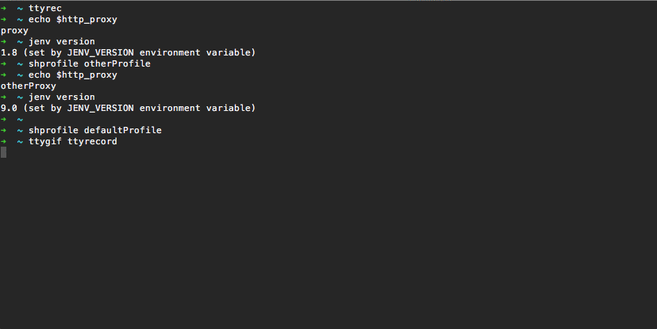

# shprofile - shell profile manager

Manage several shell profiles and switch between them, but not only.

(Formerly _terminal-session-boostrap_).



## Why?

Because we all have our own way of managing our shell session by:
- Setting the `PATH` or `PS1` variables
- Setting a proxy
- Adding aliases
- Writing a configuration file for a particular command (e.g. [vim](https://www.vim.org/)'s `.vimrc`, [screen](https://www.gnu.org/software/screen/)'s `.screenrc`)
- Applying a mandatory initialization process for a particular command line (e.g. for [jenv](http://www.jenv.be/), [nvm](https://github.com/creationix/nvm) or [rbenv](https://github.com/rbenv/rbenv))
- ... _and so on_ 

Because we can be constrained to change these specific configurations according to a given environment (e.g., when working with different clients). Then we want to manage them as _profiles_.

## How?

### Available features

- **Manage different shell profiles**
- Be able to define several scripts into a same profile, allowing then to **modularize shell profiles' scripts** (e.g., 1 script for 1 tool)
- Apply the **lexicographically order** when discovering shell profiles' scripts
- Allow to define _loading_ and _unloading_ shell profile script types to **handle transition between profiles**
- **Remember the current profile in use** to be able to quickly reload it

### Concepts

`shprofile` manages a set of _shell profiles_ which can be enabled at any time. Scripts execution is done within the current shell session, allowing scripts to modify the current shell environment.

#### Shell profile

Each shell profile is defined by a set of scripts contained into its associated entry from the `$HOME/.shprofile/profiles` folder. An entry is simply a folder that is named as the profile's name.

For instance:

```
$HOME/
    .shprofile/
        profiles/
            myfirstprofile/
                script1.sh
                script2.sh
            mysecondprofile/
                script3.sh
                script4.sh    
```

Defines two profiles `myfirstprofile` and `mysecondprofile` containing respectively the `script1.sh`, `script2.sh` and the `script3.sh`, `script4.sh` scripts.

Once profile defined, it can be simply loaded via:

```bash
$ shprofile myfirstprofile
```

And be switched by an other one via:

```bash
$ shprofile mysecondprofile
```

#### Keep current profile in memory

The current loaded profile is keeping in memory (more precisely written into a file) to be able to quickly reload it if necessary. The reload of the current profile can be done by calling `shprofile` without profile name.

Thus,

```bash
$ shprofile
```

Will reload the current profile.

This feature can be useful if wanted to execute `shprofile` at any shell's session opening. See [further](#3-bootstrap-it) for more details.

#### Structure of a script

Each script is a shell script and can be anything you want: exporting variables, setting the `PATH, applying a complex initialization process... **All scripts from the selected profile are executed within the current shell session**.

However, **the name of a script is important**. Following this name, the script can be executed differently.

##### Naming conventions

###### Execution order

Scripts are discovered following the lexicographical order. Then, if you want to execute `script1.sh` before anyone else, a good practice is to use a numerical prefix in its name:

```
1-script1.sh
``` 

###### Execution type

There are two types of scripts:
- Loading scripts (by default)
- Unloading scripts

Any script is by default a loading script, that is: executed when a profile is loading.

To handle transition between profiles, there is a second type: unloading scripts. Unloading scripts are executed before loading the required profile. An unloading script must be suffixed by the keyword `-unload`:

```
script2-unload.sh
```

##### Combine naming conventions

Of course, execution order and execution type can be combined. For instance:

```
$HOME/
    .shprofile/
        profiles/
            myfirstprofile/
                1-script1.sh
                1-script1-unload.sh
                script2.sh
                script2-unload.sh
            mysecondprofile/
                script3.sh
                script4.sh
```

This way, the `1-script1-unload.sh` will be executed when leaving the `myfirstprofile`, and before the `script2-unload.sh` one.   

### Getting started

#### 1. Install it

```bash
$ mkdir -p $HOME/.shprofile/profiles
$ curl -o $HOME/.shprofile/shprofile.sh https://raw.githubusercontent.com/abourdon/shprofile/4.1/shprofile.sh
$ alias shprofile='source $HOME/.shprofile/shprofile.sh'
```

#### 2. Enable it

1. Now you can create your first profile by creating its associated folder within `$HOME/.shprofile/profiles`:

    ```bash
    $ mkdir $HOME/.shprofile/profiles/myfirstprofile
    ```

2. Add your desired scripts into it (some examples can be found [here](examples/scripts/))

3. And finally enable it

    ```bash
    $ shprofile myfirstprofile
    ```

#### 3. Bootstrap it

A common use is to load the current profile at each shell session opening. Depending on your shell, this enabling can be done differently.

##### Bash

```bash
$ echo "alias shprofile='source $HOME/.shprofile/shprofile.sh'" >> $HOME/.bashrc
$ echo 'shprofile' >> $HOME/.bashrc
```

##### Zsh

```bash
$ echo "alias shprofile='source $HOME/.shprofile/shprofile.sh'" >> $HOME/.zshrc
$ echo 'shprofile' >> $HOME/.zshrc
```

## Need help?

```bash
$ shprofile --help
```

## Examples of shell profile's scripts  

Some examples of shell profile's scripts can be found [here](examples/scripts/).